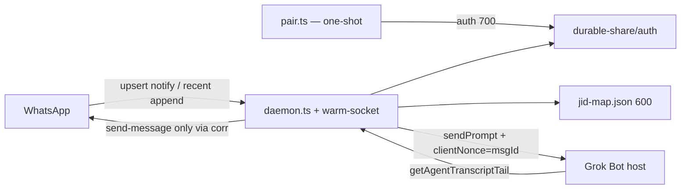

# grokbot-whatsapp-baileys-reference

Public, sanitized patterns for a **Baileys WhatsApp ↔ Grok Bot** bridge.

This is an **agent-first** reference: architecture and contracts first, then a
minimal TypeScript scaffold that shows control flow. It is **not** a fleet
clone. Copy the shapes, not anyone's live host.

**Placeholders only.** No secrets, no real phone numbers, no real WhatsApp JIDs,
no real agent UUIDs, no session auth, no private hostnames, no box-backup paths.

| Kind | Placeholder |
| --- | --- |
| Phone | `+10000000000` / `10000000000` |
| DM JID | `10000000000@s.whatsapp.net` |
| Group JID | `120000000000000000@g.us` |
| Agent UUIDs | `00000000-0000-4000-8000-000000000001` … |
| Durable share | `~/.local/share/my-baileys-bridge/` (+ `…/media/`) |

---

## Architecture an implementing agent must follow

Two processes. **Never** point a long-running host wrapper at pair.

```text
  pair.ts          one-shot device-code link → write auth (mode 700) → exit
  daemon.ts        stay-connected warm socket; this is the only host wrapper

  WhatsApp  --messages.upsert-->  inbound
                                  ├─ upsert-policy: notify + recent append (~10m)
                                  ├─ chat JID = remoteJid, else remoteJidAlt (LID)
                                  ├─ jid-map.json: jid → agentId (+ optional default)
                                  ├─ prompt = HUMAN-readable only
                                  ├─ clientNonce MUST = WhatsApp msgId
                                  └─ corr[waMsgId] = { jid, agentId, prompt }

  Grok host --transcript tail-->  outbound
                                  ├─ egress ONLY kind send-message (text or image)
                                  ├─ route via corr / jid-map — never parse JID from text
                                  └─ never CoS-hop
```



| Process | Job | Not |
| --- | --- | --- |
| `pair` | Device pairing code, persist auth, exit | Long-running, inbound, outbound |
| `daemon` | Warm socket, upsert, `sendPrompt`, tail poll, WhatsApp send | Pairing, QR loops |

`pair` and `daemon` share the same auth directory. The host wrapper **only**
starts `daemon`.

---

## Expert contracts (exact)

These are the only host/bridge rules to implement. Do not invent extras.

1. **`sendPrompt.prompt` is HUMAN-readable text only.** Never dump JIDs, `@lid`, protocol JSON, or auth into it.
2. **`clientNonce = waMsgId`.** The WhatsApp `key.id` is the nonce. Expect `{ accepted: true }`.
3. **Media uses `attachmentPaths`** pointing at local files under the durable share `…/media/` (default `~/.local/share/my-baileys-bridge/media/`).
4. **Outbound egress ONLY `kind=send-message`** (text or image/attachment). No `kind=message` + `role=assistant`, no spend-initiation, no tool calls, no `streaming=true`, no inbound echoes.
5. **Corr table routes replies:** `clientNonce / waMsgId → { jid, agentId, prompt }`.
6. **Never parse a JID from the prompt** (or from transcript text). Never CoS-hop.

## Canonical contracts

Cite **only** these shapes. Do not invent extra host fields.

### `sendPrompt` (inbound → Grok Bot)

Public helper: `@adam91holt/grokbot-sdk` `sendPrompt`.

```ts
{
  prompt: string;            // HUMAN-readable only
  agentId?: string;
  attachmentPaths?: string[];
  attachmentNames?: string[];
  replyToId?: string;
  clientNonce?: string;      // MUST = WhatsApp msgId
}
// → { accepted: true }
```

- `prompt` is what a human would read in chat. Never dump raw JIDs, `@lid`,
  protocol JSON, or auth material into it.
- `clientNonce` **must** be the WhatsApp `key.id` (`msgId`). That is the
  idempotency key and the corr-table key.
- After `{ accepted: true }`, store corr:
  `clientNonce / waMsgId → { jid, agentId, prompt }`.

### Prompt text

| Chat | Body |
| --- | --- |
| DM | `{DisplayName}:\n{body}` |
| Group | `{DisplayName} (in {GroupSubject}):\n{body}` |
| Image | Same header + caption, or `[image]` if there is no caption |

**Display name** comes from `pushName` / `notify` / profile name. Fallback is
**E.164 digits only** (`10000000000`). Never put a raw `@lid` or a full JID
dump in the prompt.

### Outbound (Grok Bot → WhatsApp)

Poll with public `@adam91holt/grokbot-sdk` `getAgentTranscriptTail`
(`{ id, limit?, beforeSeq? }`).

**Egress ONLY `kind: "send-message"`** (text, or image/attachment).

Do **not** send to WhatsApp:

- `kind: "message"` + `role: "assistant"`
- `spend-initiation`
- tool calls
- `streaming: true`
- inbound echoes (the human prompt you just submitted)

Route the send-message back to the WhatsApp chat using the **corr table**
and/or `jid-map.json`. **Never parse a JID from the prompt** or from
transcript text. **Never CoS-hop** (do not bounce one agent's reply through
another agent).

### Routing (daemon-side)

`jid-map.json` (see `jid-map.example.json`):

```json
{
  "defaultAgentId": "00000000-0000-4000-8000-000000000001",
  "agents": {
    "10000000000@s.whatsapp.net": "00000000-0000-4000-8000-000000000001",
    "120000000000000000@g.us": "00000000-0000-4000-8000-000000000002"
  }
}
```

1. Chat JID = `key.remoteJid`, else `key.remoteJidAlt` when the chat is LID.
2. Look up `agents[jid]`, then `agents[remoteJidAlt]`, then `defaultAgentId`.
3. Corr is authoritative for “this WhatsApp message → this agent → this chat”
   for the matching outbound send-message.
4. Unmapped chat + no default → drop. Do not guess. Do not scrape text.

---

## Upsert, typing, media, persistence

**`messages.upsert`:** handle `notify` and **recent** `append`. Skip stale
`append` older than ~10 minutes. Skip `fromMe`, protocol stubs, and already
seen `msgId`s.

**Typing / presence:** `composing` after a prompt is accepted; `paused` before
the WhatsApp send (or on idle / error). Do not leave composing stuck.

**Media:** download inbound images into the durable media dir; pass local paths
as `attachmentPaths` (+ optional `attachmentNames`). Outbound image
send-message uses a local file — never a transcript URL scrape.

**Persistence** (generic durable-share-dir wording only):

| Path | Mode | Contents |
| --- | --- | --- |
| `~/.local/share/my-baileys-bridge/` | `700` | Bridge root |
| `…/auth/` | `700` | Baileys multi-file auth (session material) |
| `…/media/` | `700` | Downloaded / outbound media |
| `…/jid-map.json` | `600` | jid → agentId |

Never commit auth, media, `gateway.json`, or a live `jid-map.json`.

---

## Scaffold map

| File | Role |
| --- | --- |
| `bin/grokbot-whatsapp-baileys.ts` | `pair` \| `daemon` — never default to pair |
| `src/pair.ts` | One-shot device code; write auth; exit |
| `src/daemon.ts` | Stay-connected entry |
| `src/warm-socket.ts` | Baileys socket + reconnect + creds persist |
| `src/inbound.ts` | upsert → policy → prompt → `sendPrompt` → corr |
| `src/outbound.ts` | tail → send-message filter → WhatsApp send |
| `src/jid-map.ts` | Load / resolve jid → agentId |
| `src/prompt.ts` | DM / group / image header+body |
| `src/dedupe.ts` | `waMsgId` seen-set |
| `src/wa-text.ts` | Conversation / caption extraction |
| `src/display-name.ts` | pushName / notify / profile / E.164 digits |
| `src/typing.ts` | composing / paused |
| `src/media-dir.ts` | Durable `…/media/` at mode `700` |
| `src/grok-host.ts` | Thin `sendPrompt` / `getAgentTranscriptTail` wrapper |
| `src/upsert-policy.ts` | notify + recent append |

Illustrative only. Pairing and the warm socket are stubs you wire to
`@whiskeysockets/baileys`. Host calls go through public
`@adam91holt/grokbot-sdk` (optional peer).

```bash
npm install
npm test
```

---

## Hard privacy rules

- No secrets, tokens, or `gateway.json` contents.
- No real E.164s, JIDs, or agent UUIDs — use the table at the top.
- No session auth material in git, logs, or prompts.
- No private fleet hostnames and no box-backup paths.
- Display names never render raw `@lid` / JID dumps.

Read `AGENTS.md` (do / don't) and `IMPLEMENTATION.md` (deeper wiring) before
implementing.

## License

MIT. See `LICENSE`.
